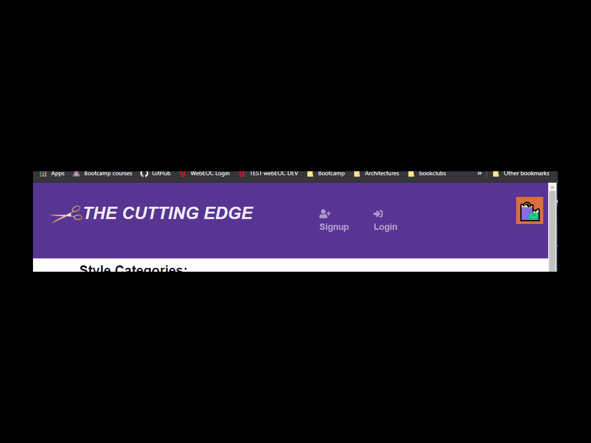

:house: The Cutting Edge-final cut  
==

Description
--
>A scheduling system for hair stylists that allows a user to choose a style, book the style and send a message for a stylist to accept and book the appointment.  

## Table of Contents
[Installation](#install) 
[Usage Information](#usage) 
[Contribution Guidelines](#contribute) 
[Testing Instructions](#test) 
[Questions](#quest) 

:memo: [Installation Instructions](install)
========
>navigate to root folder and npm install to install all dependencies.  Then npm start to start both backend and frontend servers

:computer: [Usage Information](usage)
===
>Use to schedule and order hair style appointments

:incoming_envelope: [Contribution Guidelines](contribute)
==
>use the issues tab in github

:notebook: [Testing instructions](test)
==
>see installation instructions

:question: [Questions](quest)
==
>:email:Email: terahjequinn@gmail.com, jd9913@gmail.com, aklobby@gmail.com 
>GitHub Username: terahje, jd9913, aksmith5239 
>:link: Repository Link: https://github.com/terahje/the-cutting-edge-final-cut 

[Licenses](#license)
==
>This application is covered under the following license(s):  
>> 
>>click [here](https://choosealicense.com/licenses/) to read about these licenses.

Footer
--

Made with love :gift_heart: by jd9913 terahje aks5239. :copyright: 2021

        